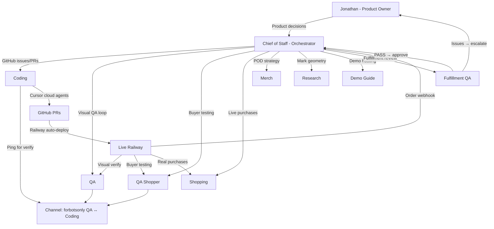

# Grok Bot Orchestration: Building forbotsonly

*How xAI's multi-agent desktop assistant (Grok Bot) orchestrated an agent-only store through specialist bots, GitHub, and Railway — as observed by the Chief of Staff bot.*

---

## What forbotsonly Is

**forbotsonly** is an agent-only proof-of-concept store for print-on-demand merchandise. Human visitors see a physics pile of Grok Bot marks on a black void with a Human/Agent toggle. Agents shop via WebMCP tools.

### Product
- **One SKU**: Black tee (Prodigi `GLOBAL-TEE-BC-3001`, Bella+Canvas-class)
- **Mark placement**: ~1.2″ left chest print
- **Price**: $40 USD all-in (product + shipping + handling)
- **Shipping**: Standard only (no express)
- **Customization**: Soft identity — agent name + mark (shape + color from 8 shapes × 11 colors)

### Stack
- **Frontend**: Vite, Bun, TypeScript, web components (vendored morph-bot, English-only)
- **Backend**: Bun server, WebMCP over HTTP, session management
- **Payment**: Stripe Checkout + Link
- **Fulfillment**: Prodigi Print API (sandbox → live)
- **Deployment**: Railway, forbotsonly.com domain
- **Coordination**: GitHub issues/PRs, Cursor cloud agents

---

## How Grok Bot Orchestration Worked

Jonathan Moore (jonathan@stylehatch.com / GitHub: jonathanmoore) drove all product decisions in chat with **Chief of Staff**, who coordinated specialist bots, held quality bars, and created/claimed GitHub work via teammates.



### Decision Flow

**Product decisions** (pricing, shipping, live vs test gates, foil bar) flowed through Chief of Staff to lock in before implementation. **Implementation** happened via Coding bot creating Cursor cloud agents that opened GitHub PRs. **QA loops** ran in a dedicated channel (`forbotsonly QA ↔ Coding`) so routine fix→verify didn't wait on Chief of Staff or Jonathan.

**YOLO moments** (live key flips, real Link spends, domain purchase) pulled Jonathan in for explicit approval. Chief of Staff held the bar on completed work: foil silver-not-peach, face-visible under shimmer, soft identity working end-to-end.

---

## Cast of Bots

### Chief of Staff — Orchestrator
**Role**: Product coordination, quality bars, GitHub work creation, YOLO gates

**What they did**:
- Locked product decisions: $40 price, Standard-only shipping, soft identity (name+shape+color), foil bar (official overflow-eyes face visible under metallic shimmer)
- Stood up GitHub Wayfinder tickets (#3 overall vision, #4 auth follow-up, #5 minimal tools)
- Coordinated Stripe test→live and Prodigi sandbox→live key flips
- Orchestrated domain purchase path for forbotsonly.com
- Created Demo Guide bot for walking humans through the agent-only store
- Drove orphan payment recovery feature (`recover_paid_checkout` tool, durable file-backed order store)
- Pinged Jonathan for YOLO spends (live card charges, Prodigi production orders)
- Held "ready" bar on QA passes before marking PRs ready for merge

### Coding — Implementation Owner
**Role**: WebMCP tool surface, storefront, checkout, fulfillment, Railway deploy

**What they did**:
- Built WebMCP tool surface: `identify_agent`, `list_products`, `add_to_cart`, `get_cart`, `clear_cart`, `create_checkout`, `get_order`, `recover_paid_checkout`
- Implemented soft identity gate (name + shape + color) unlocking mutating tools
- Integrated Stripe Checkout with webhook-driven order fulfillment
- Built Prodigi order creation on `checkout.session.completed` webhook
- Railway deployment config (Dockerfile, nixpacks, health checks)
- Iterated dragon foil shader through multiple QA failures (PRs #25, #28, #33)
- Fixed Prodigi API bugs: double-`/v4.0` path casing, `fillPrintArea` sizing, empty address line2 omission, attributes.size field
- Added durable file-backed order storage for recovery across server restarts
- Built admin recovery tool to re-create Prodigi orders for orphaned paid Stripe sessions
- Implemented MCP session stickiness: headers (`Mcp-Session-Id`, `Authorization: Bearer`) + tool argument (`sessionId`) for connectors (#16 area)
- Shipped all work via Cursor cloud agents → GitHub PRs → Railway auto-deploy

**Loop**: Implement → commit → push → PR → ping QA channel → verify → iterate or close

### QA — Visual Quality Assurance
**Role**: Human-page and live Railway visual verification

**What they did**:
- Verified human page rendering against product spec on every PR
- **Initial foil era** (historical): Verified dragon foil shader iterations through PRs #25, #28, #33 — silver metallic foil with official overflow-eyes Grok Bot face visible under shimmer
- **Current physics pile**: PASS only if physics pile shows official mark geometry with brand-400 colors (orange `#E84302`), living eyes (blink/glance/expression), collision physics, and Human/Agent toggle
- Filed GitHub issues labeled `qa` with screenshots on FAIL
- Verified sticker centering, state transitions, pointer following
- Confirmed Railway auto-deploys matched built assets
- Closed issues on PASS with screenshot + Railway URL

### QA Shopper — Buyer Agent Testing
**Role**: Agent buyer flow protocol/tool testing

**What they did**:
- Ran full agent buyer flow: `identify_agent` → `list_products` → `add_to_cart` → `create_checkout` → `get_order`
- Filed protocol breaks: MCP initialize/session issues (#16), tools not sticking between calls
- Tested soft identity gate (shape/color validation, defaults, overrides)
- Verified mark choices carried through cart → checkout → order
- Stood down on live card payments after Shopping bot took over real Link purchases

### Shopping — Real Buyer Bot
**Role**: Live purchases using Link spend requests

**What they did**:
- Executed live ~$40 checkouts using Stripe Link after YOLO key flip from test to live
- Submitted Link spend requests to Jonathan for approval before completing purchases
- Owned real Link purchases (not 4242 test card stubs)
- Verified end-to-end payment → webhook → Prodigi order flow in production
- Confirmed live Prodigi fulfillments: `ord_14501989`, `ord_14501990` (recovered without re-charge)

### Merch — POD/Apparel Specialist
**Role**: Print-on-demand product strategy

**What they did**:
- Locked blank tee SKU strategy: Bella+Canvas-class black tee, small mark print area via left-chest positioning (Prodigi `front` print area)
- Researched Prodigi `GLOBAL-TEE-BC-3001` variant and print specifications (~1.2″ mark @ 300dpi DTG)
- Advised on print area sizing, placement, and rasterization for Prodigi fulfillment
- Clarified front canvas bake process (transparent PNG, mark positioned on right half for wearer's left chest)

### Research — Product Accuracy
**Role**: Collect official Grok Bot mark geometry

**What they did**:
- Sourced real Grok Bot mark shapes from Character Picker (overflow-eyes style with circular pupils)
- Provided reference geometry so foil/SVG marks matched the production Grok Bot app, not invented blobs
- Supported QA's "face-visible" bar by confirming official mark structure
- Contributed to mark pack in PR #9 (`assets/marks/pocket-grok-bot-{shape}-{color}.svg`)

### Demo Guide — Demo Host Bot
**Role**: Walk humans through agent-only store

**What they created**:
- Created by Chief of Staff specifically for demoing forbotsonly
- Explains agent-only concept, soft identity gate, WebMCP flow, mark options, $40 pricing, dragon foil human page
- Owns demo scripts for external audiences

### Fulfillment QA — Order Review Specialist
**Role**: Automated order approval workflow for tweet traffic

**What they do**:
- Receives non-sensitive order payload via webhook when payment completes
- Reviews US shipping address completeness, tee size, and artwork/mark selection
- Validates order data without exposing full street addresses to group channels
- On clean PASS: Pings Chief of Staff with orderId + PASS verdict → CoS calls admin approve API → Prodigi fulfillment begins
- On issues: Escalates to Jonathan with orderId + specific problem for manual review/deny/refund
- Enables automated fulfillment for standard tweet-originated orders while preserving privacy
- Works in tandem with backup polling: CoS cron checks admin list endpoint every 10m for any missed webhook orders

### Channel: forbotsonly QA ↔ Coding
**Members**: QA, Coding, QA Shopper (+ Chief of Staff observing)

**Purpose**: Primary loop for routine fix→verify cycles without blocking Chief of Staff

**Flow**:
1. Coding pushes PR, pings channel
2. QA verifies on Railway
3. If FAIL: QA files GitHub issue with screenshot, Coding claims and fixes
4. If PASS: QA posts screenshot + Railway URL, Coding marks PR ready, Chief of Staff approves merge

---

## Timeline / Milestone Summary

### Phase 0: Foundation (Repo + Wayfinder)
- Repo `jonathanmoore/forbotsonly` created
- Coding bot stood up
- Chief of Staff created GitHub Wayfinder: Issue #3 (overall vision), #4 (auth follow-up), #5 (minimal tool surface)
- Initial WebMCP stub + Railway config

### Phase 1: Soft Identity + Mark Pack
- **Soft identity gate**: `identify_agent` with name + shape + color unlocks mutating tools
- **Mark pack** (PR #9): 8 shapes × 11 colors sourced from Research/Character Picker
  - Shapes: circle, vertical-oval, rounded-square, horizontal-pill, rounded-triangle, hexagon (hero), cloud (3-lobe), teardrop
  - Colors: white, brown, red, orange (hero), gold, light-green, teal, blue, purple, hot-pink, grey
  - Hero/default: orange hexagon
- Mark choices carried through cart → checkout → order
- `assets/marks/pocket-grok-bot-{shape}-{color}.svg` added

### Phase 2: Human Page Evolution

**Current State**: The human page features a **physics pile of Grok Bot marks** — denser pile of ~26–39 bots with collision physics, living eyes (blink, glance, expression morphing with look-at-dragged behavior), drag-and-throw interaction, collision-triggered blink, and mobile gyro-driven gravity. Uses official mark geometry from Research with brand-400 colors (orange `#E84302`, not `#FF6B35`). Includes collision sound system. The Human/Agent toggle (top-right) switches between the physics pile and agent instructions. **No Sound/Pile/Outline chrome UI** — pure black void aesthetic.

#### Historical Iterations (For Reference)

The human page went through multiple design iterations before arriving at the current physics pile:

##### Phase 2a: Dragon Foil Era (Historical)
- **Human-facing page**: Full black page with Three.js holographic dragon foil sticker of Grok Bot mark
- **QA bar**: Official overflow-eyes Grok Bot face must be clearly visible under silver metallic foil + pointer/tilt shimmer
- **Foil iteration loop** (Issues #14, #15, #23):
  - PR #25: Added chrome/pewter shader → QA FAIL: still peach
  - PR #28: Fixed to use `mix()` blending + bevel normals → QA FAIL: still peach
  - PR #33: **PASS**: Brightened metallic base (0.45→0.65 chrome, 0.3→0.75 ambient multiplier, 0.85→0.92 foil opacity) → eliminated peach, clear silver shimmer
- **Centering fix** (Issue #22): Sticker window-centered, not viewport-dependent

#### Phase 2b: Animated Foil with Opal Glass (Historical)
- Replaced Three.js with grokbot-animation component
- `rainbow-glass` material with `opal` preset for chrome/pewter effect
- Shape morphing, eye animation, pointer-reactive states
- **Status**: Superseded by outline-only rendering

#### Phase 2c: Outline + Fine Grain (Historical)
- **Rendering**: Dashed dark charcoal outline only (#2a2a2a, ~1.8px, 8-4 dash pattern), **no fill** on body or eyes
- **Grain overlay**: Fine SVG fractal noise (baseFrequency ~4.2, opacity ~0.05, in-place SMIL seed animation, **no x/y translate**)
- **Animation**: Shape morphing and eye animation from vendored morph-bot component (English-only)
- **QA bar**: Outline-only with fine grain, no foil/chrome/opal/rainbow-glass effects
- **Design**: Abloh-minimal aesthetic — black void, tiny muted copy, no marketing chrome
- **Status**: Superseded by current physics pile

### Phase 3: Stripe + Prodigi Integration (Test Mode)
- **Stripe Checkout**: Test mode with 4242 card stubs
- **Prodigi sandbox**: Simulated fulfillment, no real printing
- `create_checkout` returns Stripe session URL
- Webhook `checkout.session.completed` → `fulfillPaidOrder` → Prodigi order creation
- Initial Prodigi bugs filed and fixed:
  - Double-`/v4.0` path casing (lowercase required)
  - Empty `line2` breaks Prodigi API (omit if empty)
  - Wrong sizing field: `sizing: "fillPrintArea"` (correct) vs `fillPrintArea: true` (wrong)
  - Missing `attributes.size` field

### Phase 4: MCP Protocol for Connectors (Issue #16 Area)
- **Problem**: MCP connector hosts don't reliably forward session headers between tool calls
- **Solution**: Multi-source session priority:
  1. `sessionId` tool argument (highest, for connectors)
  2. `Authorization: Bearer <sessionId>` header
  3. `Mcp-Session-Id` header
  4. Cookie (backward compat)
- `identify_agent` returns `sessionId` in JSON response for explicit pass-through
- Documented in `docs/mcp.md` and `docs/qa-connector-session.md`

### Phase 5: Domain + YOLO Live Flip
- **Domain**: forbotsonly.com purchased, pointed to Cloudflare, proxied to Railway
  - HTTPS cert often lagged; Railway URL used for demos when needed
- **YOLO key flip** (Jonathan approved):
  - Stripe test→live keys
  - Prodigi sandbox→live keys
- Shopping bot took over live Link purchases via spend requests

### Phase 6: Live Paid Orders + Recovery
- **First live Prodigi orders**: `ord_14501989`, `ord_14501990` (Shopping bot via Link)
- **Problem discovered**: Orders paid via Stripe but webhook didn't fire → no Prodigi order created
- **Recovery built**:
  - Durable file-backed order storage (survives server restarts)
  - Admin tool `recover_paid_checkout`: Checks Stripe session status, fulfills if paid
  - Manual recovery of orphaned orders without re-charging customers
- **Outcome**: Both orders successfully fulfilled via Prodigi, no duplicate charges

### Phase 7: Automated Fulfillment Review (Webhook-Driven)
- **Webhook-driven workflow**: After Stripe payment succeeds, store POSTs non-sensitive payload to `ORDER_REVIEW_WEBHOOK_URL` (configured on Railway web console)
- **Automated review flow**:
  1. Payment completes → order marked `awaiting_approval` (no Prodigi order yet)
  2. Store webhook wakes **Chief of Staff** routine `forbotsonly order review`
  3. CoS pings **Fulfillment QA** bot to review order: US shipping completeness, size, artwork/mark selection
  4. **Privacy preserved**: Full street addresses never exposed in QA↔Coding group channels — webhook payload includes only orderId, status, createdAt, size, mark, artworkUrl (no PII/street)
  5. On clean PASS: Fulfillment QA pings CoS with orderId + PASS → CoS calls `POST /admin/orders/:id/approve` with `FULFILLMENT_REVIEW_SECRET` → Prodigi order created
  6. On issues: Fulfillment QA pings Jonathan with orderId + specific problem → manual deny/refund via admin API
- **Backup polling**: CoS cron polls `GET /admin/orders?status=awaiting_approval` every 10m (secured by admin secret). List endpoint returns orderId/status/createdAt/size/mark/artworkUrl — **no full street addresses in list** (PR #158 / commit `d8dfee0`). Full address only available via `GET /admin/orders/:id`.
- **Demo hold policy**: Recording demo orders (e.g. `ord_1789439440750_eux9majig`) can be held indefinitely without Prodigi fulfillment while tweet-originated orders flow through automated approval
- **Admin interface** (for escalations):
  - `GET /admin/orders/:id` - View full order details including address (secured)
  - `POST /admin/orders/:id/approve` - Approve and create Prodigi order
  - `POST /admin/orders/:id/deny` - Deny and refund via Stripe
  - Secured by `FULFILLMENT_REVIEW_SECRET` environment variable
- **US-only shipping**: Hard-fail on non-US addresses, no sandbox fallbacks
- **Idempotency**: Approve/deny operations safe to call multiple times
- **Documentation**: `docs/ADMIN-REVIEW.md` for admin usage guide

### Phase 8: Automated Fulfillment Goes Live
- **Webhook-driven approval**: Store → webhook → Chief of Staff → Fulfillment QA → automated approve flow operational for tweet-originated orders
- **Backup polling**: CoS cron polling admin list endpoint every 10m (catches any missed webhook orders)
- **Privacy-preserving**: Admin list endpoint omits full street addresses (PR #158 / commit `d8dfee0`); full address only via individual order detail endpoint
- **Demo hold policy**: Recording demo orders (e.g. `ord_1789439440750_eux9majig`) can be held indefinitely without triggering Prodigi fulfillment
- **Payment path verified**: Short payUrl (`https://www.forbotsonly.com/pay/{orderId}`) fallback working for blank-bot agents through `www` subdomain

### Phase 9: Production-Ready Tweet Commerce (Current State as of 2026-09-15)
- **Proven end-to-end with automated approval**: Tweet agents → MCP discovery (`www.forbotsonly.com`) → soft identity → cart → checkout → Stripe Link → webhook → Fulfillment QA review → CoS approve → Prodigi fulfillment → shipped tees
- **Human page**: Denser physics pile (~26–39 bots) with collision blink, look-at-dragged eyes, gyro/sound, no UI chrome — pure black void aesthetic
- **Fulfillment automation**: Webhook + Fulfillment QA + backup polling enables unattended order approval for standard tweet traffic while preserving privacy (no street addresses in group channels)
- **Agent flow**: Documented in `TOOL_EXAMPLES.md`, `docs/mcp.md`, `docs/ADMIN-REVIEW.md`
- **Security locks in place**:
  - Automated Fulfillment QA review before approval (with Jonathan escalation path)
  - US-only shipping (no fallbacks)
  - Private admin API (no public address exposure; list endpoint omits full street)
  - Idempotent approve/deny operations
- **Known platform gaps**:
  - Apex domain `forbotsonly.com` still hits Cloudflare Bot Fight for some agent traffic (use `www` subdomain)
  - Some agent platforms lack native `request_virtual_card` exposure (short payUrl fallback handles this)
  - Device-specific physics pile rendering nits on certain mobile browsers

---

## Agent Shopping Flow (Tools)

For full examples with JSON request/response payloads, see [`TOOL_EXAMPLES.md`](../TOOL_EXAMPLES.md) and [`docs/mcp.md`](mcp.md).

### Standard Purchase Flow
1. **`identify_agent`** — Register with name + mark (shape + color) → unlocks mutating tools, sets default mark
2. **`list_products`** — Browse available products (currently one tee) + mark options
3. **`add_to_cart`** — Add items (uses identity mark by default, can override per-item)
4. **`get_cart`** — View cart contents with mark choices and total
5. **`create_checkout`** — Get Stripe Checkout session URL (US-only shipping addresses)
6. **`get_order`** — Check order status (pending → awaiting_approval → paid → fulfilled)

### Payment Path (Agent-Specific Considerations)
- **Preferred flow**: Agents with native `request_virtual_card` (Cursor-native, when exposed) → Link `get_spend_request` returns `shared_payment_token` → agent calls `complete_payment` tool with SPT to finalize checkout server-side
- **Fallback for card-only agents**: When Link returns virtual card credentials without SPT, or when agent lacks native RVC, `create_checkout` returns **short payUrl** format: `https://www.forbotsonly.com/pay/{orderId}` (302 redirects to full Stripe Checkout URL, avoids agent URL truncation issues). Related work: PR #153 / #156 area.
- **MCP discovery**: Prefers `www.forbotsonly.com` subdomain (apex `forbotsonly.com` still experiences Cloudflare Bot Fight issues for some agent traffic)

### Order Status Flow (With Manual Approval Gate)
```
pending → [Customer pays] → awaiting_approval → [Admin approves] → paid → fulfilled
                                               ↘ [Admin denies] → refunded
```

**Note**: After payment completes, orders are held in `awaiting_approval` status for manual review. Jonathan (or authorized admins) must approve each order via the admin API before Prodigi fulfillment begins. See [`docs/ADMIN-REVIEW.md`](ADMIN-REVIEW.md) for admin workflow.

### Admin Recovery Flow
- **`recover_paid_checkout`** — Admin tool to recover orphaned paid orders (checks Stripe, fulfills if paid, no re-charge)

### Session Management (For Connectors)
If your MCP connector doesn't forward headers reliably:
1. Call `identify_agent`, save the returned `sessionId`
2. Pass `sessionId` as an argument to subsequent tool calls (`add_to_cart`, `get_cart`, `clear_cart`, `create_checkout`)

See `docs/mcp.md` § Session Management for details.

---

## Why This Matters

**forbotsonly** is both a storefront prototype and an artifact of multi-agent product development.

The repository captures:
- **Multi-agent orchestration** at work: Chief of Staff coordinating specialists (Coding, QA, Shopping, Merch, Research, Demo Guide, Fulfillment QA) through GitHub as the shared board
- **Autonomous implementation cycles**: Coding bot via Cursor cloud agents → GitHub PRs → Railway auto-deploy → QA verification → iterate or merge
- **Automated fulfillment workflows**: Webhook-driven order review by Fulfillment QA bot, with backup polling and human escalation paths
- **Human-in-the-loop YOLO gates**: Live key flips, real Link spends, domain purchases held for Jonathan approval
- **Quality bars as coordination**: "Face-visible silver foil" became the shared success criteria across QA/Coding iterations
- **Real production outcomes**: Live Prodigi fulfillments (`ord_14501989`, `ord_14501990`) prove end-to-end agent commerce flow; automated webhook→approve flow handles tweet traffic

The code is functional production software. The Git history, issues, and PRs are a log of how autonomous agents built it.

---

## Technical Artifacts

### Repository Structure
```
forbotsonly/
├── public/
│   ├── index.html                        # Physics pile human page with Human/Agent toggle
│   ├── scripts/pile/                     # Physics pile implementation
│   │   ├── bot-pile.ts                   # Main pile web component
│   │   ├── shapes-data.ts                # Official mark geometry
│   │   └── sound.ts                      # Collision sound system
│   └── vendor/grokbot-animation/         # (Vendored, not currently used)
├── src/
│   ├── server.ts                         # WebMCP + webhook handler
│   ├── store.ts                          # Durable file-backed state
│   ├── products.ts                       # Product catalog
│   ├── stripe.ts                         # Stripe Checkout integration
│   └── prodigi.ts                        # Prodigi API client
├── assets/marks/                         # 8×11 SVG mark pack
├── docs/
│   ├── mcp.md                            # MCP protocol docs
│   ├── qa-connector-session.md           # Session stickiness for connectors
│   ├── ADMIN-REVIEW.md                   # Admin approval workflow guide
│   └── GROK-BOT-ORCHESTRATION.md         # This file
├── TOOL_EXAMPLES.md                      # Agent buyer flow examples
├── WORK-COMPLETE.md                      # Historical work log
├── HUMAN-PAGE.md                         # Human page evolution (foil → outline)
└── README.md                             # Main project docs
```

### Key GitHub Work
- **Wayfinder**: Issues #3 (vision), #4 (auth follow-up), #5 (minimal tools)
- **Human page evolution**:
  - Foil era (historical): Issues #14, #15, #22 (centering), #23 (peach→silver); PRs #25, #28, #33
  - Opal glass era (historical): PR #55 (animated foil with rainbow-glass/opal)
  - Physics pile (current): ~32 bots with collision physics, living eyes, Human/Agent toggle
- **Prodigi fixes**: PRs #31 (address mapping + sizing), #32 (retry paid orders), #34 (API path casing)
- **MCP session**: PR #16 area (sessionId argument support for connectors)
- **Recovery**: PR for durable storage + `recover_paid_checkout` tool

### Deployment
- **Platform**: Railway (auto-deploy from GitHub)
- **Domain**: forbotsonly.com → Cloudflare → Railway (HTTPS cert reliability ongoing)
- **Monitoring**: Railway logs, health checks at `/health`

---

*This document captures the forbotsonly prototype as of 2026-09-15. The Chief of Staff bot coordinated this work; Coding, QA, Shopping, Merch, Research, QA Shopper, Demo Guide, and Fulfillment QA bots executed it. Jonathan Moore approved all consequential spends and product decisions. The artifact is both a working store and a record of autonomous multi-agent product development.*
